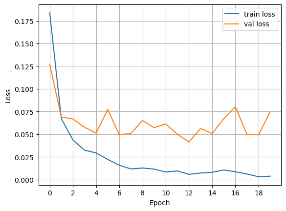
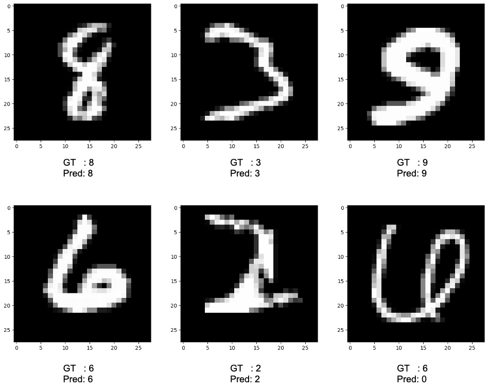

# Convolutional Neural Network (CNN) Image Classification
한국어 버전의 설명은 [여기](./docs/README_ko.md)를 참고하시기 바랍니다.


## Introduction
A Convolutional Neural Network (CNN) is a model that can be used not only for images but also for various types of data, such as natural language.
It performs calculations on data based on convolution operations and trains the model accordingly.
Particularly for images, CNNs demonstrate exceptional performance and remain one of the most widely used models today.
In this code, we will train a model to predict the labels of the MNIST dataset using a CNN.
For more information on CNNs, please refer to [Convolutional Neural Network (CNN)](https://ljm565.github.io/contents/CNN1.html).
<br><br><br>

## Supported Models
### CNN
* A CNN using `nn.Conv2d` is implemented.
<br><br><br>

## Base Dataset
* Base dataset for tutorial is [MNIST](http://yann.lecun.com/exdb/mnist/).
* Custom datasets can also be used by setting the path in the `config/config.yaml`.
However, implementing a custom dataloader may require additional coding work in `src/utils/data_utils.py`.
<br><br><br>

## Supported Devices
* CPU, GPU, multi-GPU (DDP), MPS (for Mac and torch>=1.12.0)
<br><br><br>

## Quick Start
```bash
python3 src/run/train.py --config config/config.yaml --mode train
```
<br><br>

## Project Tree
This repository is structured as follows.
```
├── configs                     <- Folder for storing config files
│   └── *.yaml
│
└── src      
    ├── models
    |   └── cnn.py              <- CNN model file
    |
    ├── run                   
    |   ├── cal_acc.py          <- Calculating accuracy of the trained model
    |   ├── train.py            <- Training execution file
    |   └── validation.py       <- Trained model evaulation execution file
    | 
    ├── tools                   
    |   ├── model_manager.py          
    |   └── training_logger.py  <- Training logger class file
    |
    ├── trainer                 
    |   ├── build.py            <- Codes for initializing dataset, dataloader, etc.
    |   └── trainer.py          <- Class for training, evaluating, and calculating accuracy
    |
    └── uitls                   
        ├── __init__.py         <- File for initializing the logger, versioning, etc.
        ├── data_utils.py       <- File defining the custom dataset dataloader
        ├── filesys_utils.py       
        └── training_utils.py     
```
<br><br>

## Tutorials & Documentations
Please follow the steps below to train a CNN image classification model.
1. [Getting Started](./docs/1_getting_started.md)
2. [Data Preparation](./docs/2_data_preparation.md)
3. [Training](./docs/3_trainig.md)
4. ETC
   * [Evaluation](./docs/4_model_evaluation.md)
   * [Accuracy Calculation](./docs/5_acc_cal.md)

<br><br><br>

## Training Results
* Results of CNN<br><br>
    <br>
    Test set loss: 0.042665<br>
    Test set acc: 0.989600<br><br>

* MNIST Test Data Prediction Results<br><br>
    
    <br><br><br>