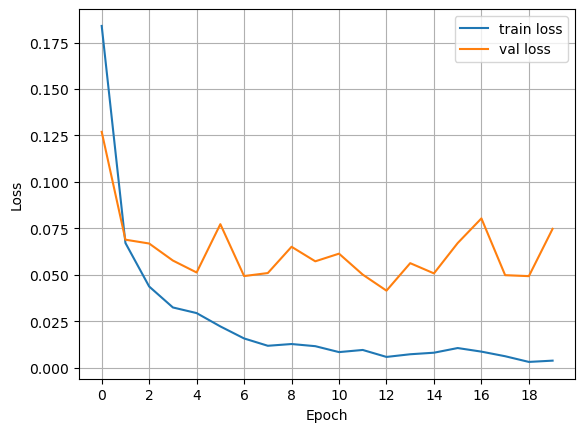
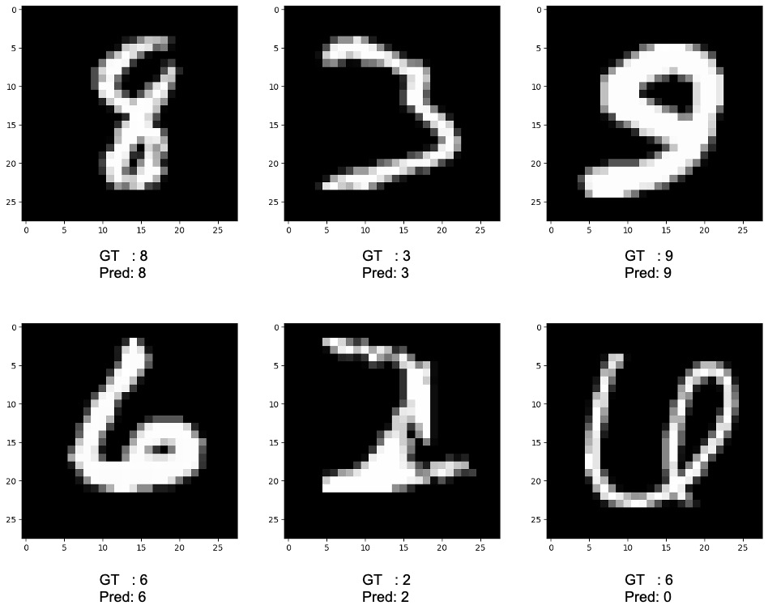

# Convolutional Neural Network (CNN) Image Classification

## Introduction
Convolutional Neural Network (CNN)은 이미지 뿐 아니라 자연어 등 다양한 데이터에 사용될 수 있는 모델입니다.
합성곱 기반으로 데이터를 계산하고 모델을 학습합니다.
특히 이미지에 대해 뛰어난 성능을 보이며, 지금까지도 가장 많이 쓰는 모델입니다.
본 코드에서는 CNN 기반으로 MNIST 데이터의 label을 예측하는 모델을 학습합니다. 
CNN에 대한 설명은 [Convolutional Neural Network (CNN)](https://ljm565.github.io/contents/CNN1.html)를 참고하시기 바랍니다.
<br><br><br>

## Supported Models
### CNN
* `nn.Conv2d`를 사용한 CNN이 구현되어 있습니다.
<br><br><br>

## Base Dataset
* 튜토리얼로 사용하는 기본 데이터는 [Yann LeCun, Corinna Cortes의 MNIST](http://yann.lecun.com/exdb/mnist/) 데이터입니다.
* `config/config.yaml`에 학습 데이터의 경로를 설정하여 사용자가 가지고 있는 custom 데이터도 학습 가능합니다.
다만 `src/utils/data_utils.py`에 custom dataloader 코드를 구현해야할 수도 있습니다.
<br><br><br>

## Supported Devices
* CPU, GPU, multi-GPU (DDP), MPS (for Mac and torch>=1.12.0)
<br><br><br>

## Quick Start
```bash
python3 src/run/train.py --config config/config.yaml --mode train
```
<br><br>


## Project Tree
본 레포지토리는 아래와 같은 구조로 구성됩니다.
```
├── configs                         <- Config 파일들을 저장하는 폴더
│   └── *.yaml
│
└── src      
    ├── models
    |   └── cnn.py                  <- CNN 모델 파일
    |
    ├── run                   
    |   ├── cal_acc.py              <- Accuracy 계산 실행 파일
    |   ├── train.py                <- 학습 실행 파일
    |   └── validation.py           <- 학습된 모델 평가 실행 파일
    | 
    ├── tools    
    |   ├── model_manager.py          
    |   └── training_logger.py      <- Training logger class 파일
    |
    ├── trainer                 
    |   ├── build.py                <- Dataset, dataloader 등을 정의하는 파일
    |   └── trainer.py              <- 학습, 평가, accuracy 계산 class 파일
    |
    └── uitls                   
        ├── __init__.py             <- Logger, 버전 등을 초기화 하는 파일
        ├── data_utils.py           <- Custom dataloader 파일
        ├── filesys_utils.py       
        └── training_utils.py     
```
<br><br>

## Tutorials & Documentations
CNN 이미지 분류 모델 학습을 위해서 다음 과정을 따라주시기 바랍니다.
1. [Getting Started](./1_getting_started_ko.md)
2. [Data Preparation](./2_data_preparation_ko.md)
3. [Training](./3_trainig_ko.md)
4. ETC
   * [Evaluation](./4_model_evaluation_ko.md)
   * [Accuracy Calculation](./5_acc_cal_ko.md)
<br><br><br>


## 결과
* CNN 결과<br><br>
    <br>
    Test set loss: 0.042665<br>
    Test set acc: 0.989600<br><br>

* MNIST test set 예측 결과<br><br>
    
    <br><br><br>